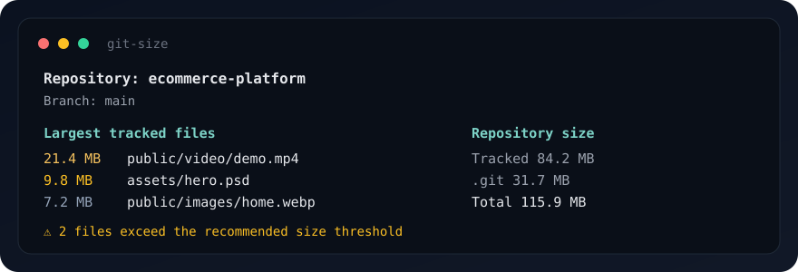

<p align="center">
  
</p>

<h1 align="center">git-size</h1>

<p align="center">
  <strong>Understand what's making your Git repository heavy.</strong>
</p>

<p align="center">
  Find large tracked files, directories, file types, and history bloat.<br>
  Local only. No network. No telemetry.
</p>

<p align="center">
  <a href="https://www.npmjs.com/package/git-size"></a>
  <a href="https://github.com/boroppi/git-size/actions/workflows/ci.yml"></a>
  <a href="package.json"></a>
  <a href="package.json"></a>
  <a href="LICENSE"></a>
</p>

<p align="center">
  
</p>

```bash
npx git-size
```

---

## Why

`du` and Explorer show everything on disk. That includes `node_modules`, build output, and anything else Git is already ignoring.

`git-size` reports **what Git is actually tracking** — plus, when you ask, what is still sitting in history after you deleted it.

Requires **Node.js 20+**. Zero runtime dependencies.

## Features

| | |
| --- | --- |
| **Tracked files only** | Ignored paths stay out unless they are actually committed |
| **Readable report** | Largest files, inclusive directories, file types, and extensions |
| **History** | `--history` finds large reachable blobs, including deleted ones |
| **CI** | `--ci` with `--max-file-size` / `--max-repo-size` and exit codes |
| **JSON** | Structured output for scripts, not a scraped terminal dump |
| **Local** | No uploads, no network, `NO_COLOR` respected |

## Install

```bash
npm install --global git-size
```

Or skip the install:

```bash
npx git-size
```

## Example

```text
git-size
Repository: ecommerce-platform
Path:       /work/ecommerce-platform
Branch:     main

Repository size
──────────────────────────────────────────────
Tracked files   84.2 MB
Git directory   31.7 MB
        Total   115.9 MB

Largest tracked files (1284 files)
──────────────────────────────────────────────
 21.4 MB   public/video/demo.mp4
  9.8 MB   assets/hero.psd
  7.2 MB   public/images/home.webp

Largest directories
──────────────────────────────────────────────
 32.4 MB   public/
 18.1 MB   assets/
Directory sizes include nested tracked files.

File types
──────────────────────────────────────────────
Video        21.4 MB    2 files
Images       14.2 MB   38 files
JavaScript    6.1 MB  143 files

⚠ 2 files exceed the recommended size threshold.

💡 Consider Git LFS for large binary assets.
```

## Commands

| Command | What you get |
| --- | --- |
| `git-size` | Default report for the current repository |
| `git-size --largest 20` | Show 20 largest files and directories |
| `git-size --history` | Include reachable Git object analysis |
| `git-size --json` | Structured JSON on stdout |
| `git-size --ci` | Concise CI report; non-zero if limits fail |
| `git-size --help` | Usage and examples |
| `git-size --version` | Version from `package.json` |

```bash
git-size --largest 20
git-size --history
git-size --json
git-size --ci --max-file-size 10MB
```

Works from a subdirectory. Handles detached HEAD, empty repos, spaces, and Unicode filenames.

### Options

| Option | Description |
| --- | --- |
| `--largest <n>` | How many files/directories to list (default `10`) |
| `--history` | Analyze reachable Git objects |
| `--json` | Machine-readable JSON (not with `--ci`) |
| `--ci` | Concise output and enforce configured limits |
| `--max-file-size <size>` | Fail CI when a tracked file exceeds this |
| `--max-repo-size <size>` | Fail CI when tracked + `.git` exceeds this |
| `--config <path>` | Read a specific JSON config file |

Sizes use binary units: `500KB`, `10MB`, `1GB`. `MiB` spellings are accepted too.

## Configuration

Optional. If present, `.git-size.json` is read from the repository root.

```json
{
  "maxFileSize": "10MB",
  "maxRepositorySize": "500MB",
  "largestFiles": 10,
  "ignore": ["coverage/**"]
}
```

| Field | Meaning |
| --- | --- |
| `maxFileSize` | CI limit for one tracked file |
| `maxRepositorySize` | CI limit for tracked files plus `.git` |
| `largestFiles` | How many largest files/directories to show |
| `ignore` | Simple globs against tracked paths (`coverage/**`, `*.log`) |

CLI flags override the file. Use `--config path/to/git-size.json` for a custom path.

## CI

`--ci` prints a short report, skips decoration, and exits `1` when a limit is exceeded.

```bash
git-size --ci --max-file-size 10MB
git-size --ci --max-repo-size 500MB
```

Limits can live in `.git-size.json` so the CI command stays short. With no limit, CI mode still reports and exits `0`.

| Code | Meaning |
| :---: | --- |
| **0** | Success, or CI with no violated limits |
| **1** | A configured CI limit was exceeded |
| **2** | User error — not a Git repo, bad flags, bad config |

## JSON

```bash
git-size --json > git-size-report.json
```

Numbers are bytes. Paths are Git paths. No ANSI, no absolute-path decoration beyond `repository.path`.

<details>
<summary><strong>JSON shape</strong></summary>

```json
{
  "repository": {
    "path": "/path/to/repository",
    "name": "repository",
    "branch": "main",
    "gitDirectory": "/path/to/repository/.git",
    "hasCommits": true
  },
  "sizes": {
    "workingTree": 42800000,
    "gitDirectory": 18300000,
    "total": 61100000
  },
  "trackedFileCount": 1284,
  "missingTrackedFiles": [],
  "directoryCount": 112,
  "largestFiles": [{ "path": "public/video.mp4", "size": 18400000, "kind": "file" }],
  "largestDirectories": [{ "path": "public/", "size": 32000000 }],
  "fileTypes": [{ "category": "Video", "size": 18400000, "count": 2 }],
  "extensions": [{ "extension": ".mp4", "category": "Video", "size": 18400000, "count": 2 }],
  "warnings": [],
  "recommendations": []
}
```

</details>

## History

```bash
git-size --history
```

Uses Git plumbing (`count-objects`, `rev-list --objects --all`, `cat-file`) for loose/packed size, object counts, and the largest reachable blobs.

Filenames appear only when Git can associate them. A large historical object may be content you already deleted from the working tree.

Unreachable dangling objects and reflogs are not claimed.

## Privacy

> git-size does not upload, transmit, or collect repository data.

- Only tracked files are measured
- Filenames go through process APIs, never a shell string
- Symlinks are measured as links, not followed
- `NO_COLOR` and non-TTY output are respected

See [SECURITY.md](SECURITY.md).

## Development

```bash
npm install
npm run typecheck
npm run lint
npm test
npm run build
```

Tests include temporary real Git repositories for nested directories, special filenames, empty repos, and CI exit codes.

See [CONTRIBUTING.md](CONTRIBUTING.md).

## License

[MIT](LICENSE) · [Burak Kaya](https://github.com/boroppi)
